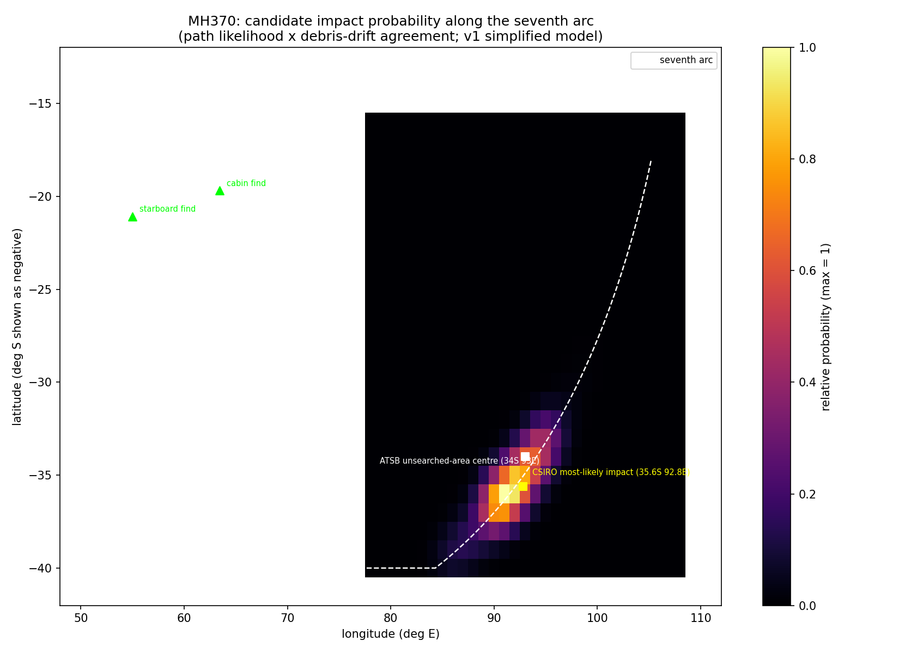

# mh370-search

Where is Flight MH370? A probabilistic search of the southern Indian Ocean built from public data: radar fixes, satellite ATOC timestamps, the seventh-arc geometry, and confirmed debris locations.

## What it does

1. Reconstructs the "seventh arc" — the constant-range circle from the 2014-03-09 08:19:54 UTC Inmarsat ping — as a ground circle centred on the Inmarsat-3 F1 sub-satellite point (0, 64.5E), radius fitted to the documented anchor point (34.13S, 93.95E).
2. Validates that geometry against JACC's published statement that the arc reaches from latitude 20S to 39S (`tests/test_ping_arc.py`).
3. Samples ~2,000 candidate flight paths from the turn region (Andaman Sea / S China Sea) to points on the arc, keeping only those whose speed and implied meander time are physically plausible given fuel exhaustion at the arc.
4. Drifts floating debris from each grid cell under a simplified regional current field and scores how well the predicted drift matches where debris actually washed up (Reunion flaperon 2015, Mozambique belly panel 2017, plus probable/unconfirmed finds).
5. Multiplies path likelihood by drift agreement into a probability heatmap.

## Result (v1)

The top-scoring cells sit at **35-36S, 91-93E** — within ~1 degree of both the ATSB unsearched-area centre (34S 93E) and CSIRO's final most-likely impact estimate (35.6S 92.8E), using only public data and a deliberately simple model:



## Layout

```
data/curated/   cleaned, documented datasets + data dictionary (committed)
src/mh370/      package: geodesy, ping arc, flight paths, drift, scoring
tests/          unit tests incl. the JACC arc-extent validation
output/         generated heatmap
```

## Setup

```bash
python -m venv .venv
.venv\Scripts\pip install -r requirements.txt pytest   # Windows; use bin/pip on Linux/macOS
set PYTHONPATH=src                                      # Windows (or export PYTHONPATH=src)
python -m mh370.run_analysis --candidates 2000
python -m pytest tests/
```

## Known simplifications (v1)

- The seventh arc is a ground circle, not the exact constant-slant-range locus to the satellite in space. Good to tens of km for this use; validated against JACC's stated extent.
- Drift uses a two-region constant current field calibrated so mean drift from the southern arc reaches both confirmed find locations within a few hundred nm over their advection periods. A real model would use reanalysis currents (e.g. CMEMS) and wind-driven leeway per debris type.
- The zig-zag meander is approximated by a loiter window rather than simulated turn-by-turn.

Full source list and confidence levels: [data/curated/data_dictionary.md](data/curated/data_dictionary.md).
